# SMELTER 🛠

```
███████╗███╗   ███╗███████╗██╗  ████████╗███████╗██████╗
██╔════╝████╗ ████║██╔════╝██║  ╚══██╔══╝██╔════╝██╔══██╗
███████╗██╔████╔██║█████╗  ██║     ██║   █████╗  ██████╔╝
╚════██║██║╚██╔╝██║██╔══╝  ██║     ██║   ██╔══╝  ██╔══██╗
███████║██║ ╚═╝ ██║███████╗███████╗██║   ███████╗██║  ██║
╚══════╝╚═╝     ╚═╝╚══════╝╚══════╝╚═╝   ╚══════╝╚═╝  ╚═╝
```

A local Ethereum node written in go powered by geth, supports multiple forks and simulation, with support for otterscan block explorer
[](https://deepwiki.com/raul0ligma/smelter)
### Installation

```bash
git clone github.com/rahul0tripathi/smelter
cd smelter
go run cmd/main.go --rpcURL https://eth.llamarpc.com --stateTTL 5m --cleanupInterval 3m
```

### Request

```bash
curl --request POST \
  --url http://localhost:6969/v1/rpc/:key \
  --header 'Content-Type: application/json' \
  --data '{
  "method": "eth_getBlockByNumber",
  "params": [
    "0x132fba9",
    false
  ],
  "id": 6,
  "jsonrpc": "2.0"
}'
```

> The key param is used to assign and manage the fork state, each key identifies a state which is cleared after --stateTTL value (default 10m)

```
============================================================
RPC_URL		https://eth.llamarpc.com
CHAIN_ID	1
FORK_BLOCK	20120497
============================================================

⇨ http server started on [::]:6969

2024-06-19T00:11:58.048+0530	DEBUG	services/eth_rpc.go:220	Called SendRawTransaction	{"encoded": "0xe8018082753094c02aaa39b223fe8d0a0e5c4f27ead9083c756cc285e8d4a5100084d0e30db0808080"}
2024-06-19T00:12:02.206+0530	DEBUG	services/eth_rpc.go:257	trace

 [CALL] 0x0000000000000000000000000000000000000069 => 0xC02aaA39b223FE8D0A0e5C4F27eAD9083C756Cc2 [0xe8d4a51000] (0xd0e30db0)
 [RETURN] 0x0000000000000000000000000000000000000069 => 0xC02aaA39b223FE8D0A0e5C4F27eAD9083C756Cc2 [] (0x (26074) ERR: (<nil>) REVERTED: false)

2024-06-19T00:12:02.207+0530	DEBUG	services/eth_rpc.go:283	Called GetTransactionByHash	{"txHash": "0x77846b3841fded7bcd150910a14fa6402105b0166c8323f6e29f105a6682e322"}
```

## Supported RPC Methods

<table>
<tr>
<th>ETH JSON RPC</th>
<th>OTTERSCAN</th>
<th>SMELTER</th>
</tr>
<tr valign="top">
<td>

- eth_chainId
- eth_blockNumber
- eth_getBlockByHash
- eth_getStorageAt
- eth_getHeaderByHash
- eth_getHeaderByNumber
- eth_call
- eth_sendRawTransaction
- eth_getTransactionReceipt
- eth_getTransactionByHash
- eth_estimateGas
- eth_gasPrice
- eth_getBlockByNumber
- eth_getBalance
- eth_getCode
- eth_setBalance
- eth_getTransactionCount

</td>
<td>

- ots_getApiLevel
- ots_hasCode
- ots_getContractCreator
- ots_searchTransactionsBefore
- ots_getBlockDetails
- ots_getTransactionError
- ots_getBlockTransactions
- ots_traceTransaction

</td>
<td>

- smelter_impersonateAccount
- smelter_stopImpersonatingAccount
- smelter_getState
- smelter_setStateOverrides

</td>
</tr>
<tr>
<td><a href="https://ethereum.github.io/execution-apis/api-documentation/">ETH JSON RPC Spec</a></td>
<td><a href="https://github.com/otterscan/otterscan/blob/develop/docs/custom-jsonrpc.md">OTTERSCAN RPC Spec</a></td>
<td>See descriptions below</td>
</tr>
</table>

### SMELTER Namespace Details

| Method Name                        | Description                                                                                             |
| ---------------------------------- | ------------------------------------------------------------------------------------------------------- |
| `smelter_impersonateAccount`       | Impersonates an account with the given address. All further executions are executed with this as sender |
| `smelter_stopImpersonatingAccount` | Stops impersonating the current account                                                                 |
| `smelter_getState`                 | Retrieves the current state as a JSON message                                                           |
| `smelter_setStateOverrides`        | Sets state overrides with the provided values. All further executions are executed with these values    |

## RPC Modes

SMELTER supports two RPC provider modes:

### Standard RPC

The default mode processes each request individually, suitable for simple interactions.

```go
// Create a standard RPC provider
rpcProvider := provider.NewJsonRPCProvider("https://eth.llamarpc.com")
```

### Batched RPC

For improved performance, the batched RPC provider combines multiple requests into a single network call:

```go
// Create a batch-capable RPC provider
rpcProvider, _ := provider.NewBatchJSONRPcProvider("https://eth.llamarpc.com")

// Send multiple requests in one call
requests := []entity.BatchReq{
    {Method: "eth_getBalance", Params: []any{address.Hex(), blockNumber}},
    {Method: "eth_getCode", Params: []any{contractAddr.Hex(), blockNumber}},
}
responses, err := rpcProvider.Batch(context.Background(), requests)
```

The batched mode significantly improves performance when loading multiple storage slots or contract states by reducing network round trips.

## Prefetcher

The prefetcher module analyzes transactions before execution to preload relevant contract storage slots, which significantly speeds up simulation time:

```go
import (
    "github.com/rahul0tripathi/smelter/prefetcher"
    "github.com/ethereum/go-ethereum/common"
)

// Create a new prefetcher
fetcher := prefetcher.NewPrefetcher(rpcProvider, db)

// Analyze transaction and prefetch relevant storage
msg := ethereum.CallMsg{
    From:  sender,
    To:    &contractAddress,
    Data:  txData,
    Gas:   gasLimit,
    Value: value,
}
fetcher.AnalyzeTxAndPrefetch(ctx, msg)
```

The prefetcher currently supports:

- Gnosis Safe's `execTransaction` method by default, automatically loading relevant storage slots
- Custom signature handlers can be registered for specific contract interactions

By prefetching storage slots and analyzing the transaction calldata pattern, the prefetcher reduces the number of individual RPC calls needed during simulation, significantly improving performance for complex contract interactions.

Example usage in a test:

```go
// Set up the environment
reader, _ := provider.NewBatchJSONRPcProvider("https://rpc-endpoint.com")
db := fork.NewDB(reader, forkCfg, accountsStorage, accountsState)
fetcher := prefetcher.NewPrefetcher(reader, db)

// Analyze and prefetch before execution
fetcher.AnalyzeTxAndPrefetch(ctx, callMsg)

// Execute with prefetched state
exec.CallAndPersist(ctx, callMsg, tracer, stateOverrides)
```

## Architecture



## Demo

https://github.com/rahul0tripathi/smelter/assets/48456755/43de1c0d-7ac2-43fd-92f7-4a829e2b8b57

### References

- [https://github.com/ethereum/go-ethereum](https://github.com/ethereum/go-ethereum)
- [https://github.com/foundry-rs/foundry/blob/master/crates/anvil](https://github.com/foundry-rs/foundry/blob/master/crates/anvil/)
